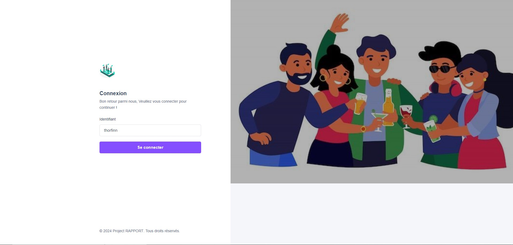
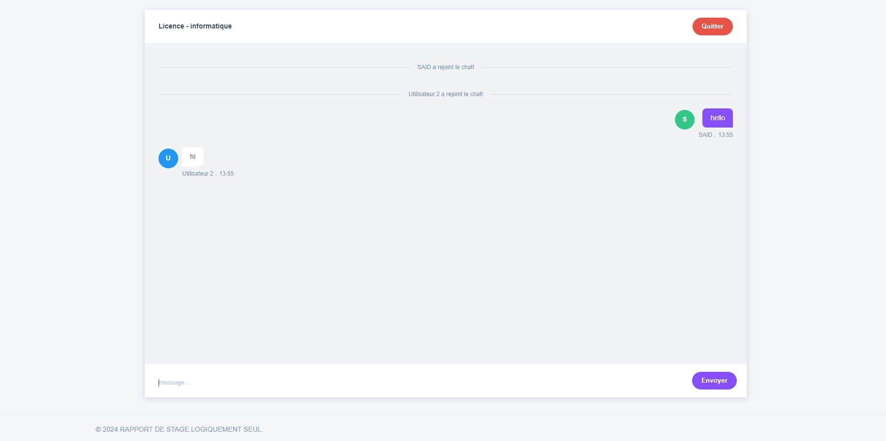

# Application de Chat en Groupe

Bienvenue dans notre application de chat en groupe utilisant la technologie WebSocket, développée en Java. Cette application offre une plateforme sécurisée et interactive permettant aux utilisateurs de créer des salons de discussion, d'inviter leurs amis et de partager des messages en temps réel.

## Fonctionnalités principales

- **Connexion au réseau local** : Utilisation de la technologie WebSocket pour faciliter la connexion des utilisateurs au réseau local. Connectez-vous à votre réseau Wi-Fi et entrez les informations de connexion fournies.
- **Nom d'utilisateur personnalisé** : Chaque utilisateur peut spécifier un nom d'utilisateur unique, facilitant ainsi la communication et créant un environnement convivial.
- **Discussions en groupe** : Accédez à une liste des différents groupes de discussion disponibles dans le réseau local, rejoignez un groupe existant ou créez le vôtre. Les messages sont visibles par tous les membres du groupe en temps réel.
- **Fonctionnalités de discussion de base** : Envoi de messages texte, envoi de fichiers, ajout de réactions aux messages et suppression de messages inappropriés pour une expérience de discussion fluide.

## Captures d'écran

### Page d'accueil


### Page principale


## Comment exécuter le projet

Pour exécuter cette application localement, suivez les étapes ci-dessous :

1. **Cloner le dépôt**
   ```bash
   git clone https://github.com/caranvalis/Web_Chat_App.git
   cd Web_Chat_App
   ```

2. **Construire le projet avec Gradle**
   ```bash
   ./gradlew build
   ```

3. **Exécuter l'application**
   ```bash
   ./gradlew bootRun
   ```

4. **Accéder à l'application**
   Ouvrez votre navigateur et rendez-vous sur `http://localhost:8080`.

## Technologies utilisées

- **Java** : Langage de programmation principal.
- **WebSocket** : Pour une communication bidirectionnelle en temps réel.
- **HTML/CSS/JavaScript** : Pour le frontend de l'application.

## Licence

Ce projet est sous licence GPL-3.0. Voir le fichier [LICENSE](LICENSE) pour plus de détails.

## Contribuer

Les contributions sont les bienvenues ! Pour commencer, veuillez consulter les [instructions de contribution](CONTRIBUTING.md).
